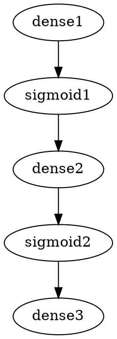

# FUTURE HOME OF NetDOT an expansion of GraphViz DOT format for NN architectures
https://graphviz.org/doc/info/lang.html

## Concept
Create an extension of GraphViz DOT that is fully compatible with the rendering engine to generate graph images but can also be used to create full neural networks. This will mostly be implemented via custom attributes which GraphViz can safely ignore but this parser will not. Most attributes will be on the graph vertices, but some will be available for edges as well. 

## Example
Below is an concept for making a classical 2-2-1 neural network using DOT attributes. Note, attribute names and namespaces are subject to change. 
